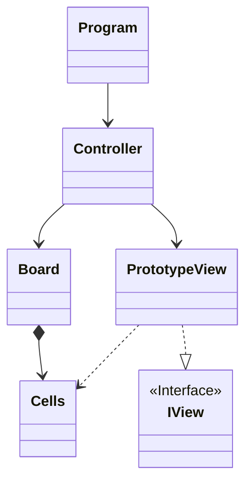

# Projeto final: Blackout

Diciplina: Linguagens de Programação I [Videojogos]

Instituição: Universidade Lusófona Lisboa

Professores: Afonso Oliveira, Rafael Jos´e, Nuno Fachada

Ano letivo: 2025/2026

Alunos: Goncalo Almeida a22504073 / Isis Rocha a22504772

## Divisão de trabalho: 
#### Goncalo Almeida
- Protótipo do projeto em script único com a lógica principal do jogo para ser aplicado em modelo MVC. Ainda sem randomização das celulas.

- Ajuste do protótipo para o coincidir em modelo MVC script entre as classes Controller, PrototypeView e Board.

- Modificação do projeto para aplicar a randomização de celulas de acordo com a dificuldade. 

- Documentação das linhas de Código do projeto. 

#### Isis Rocha

- Implementação da biblioteca Spectre.Console no projeto. 

- Criação da classe Cells e ajuste do projeto para implementar a classe adequadamente. 

- Pequenos ajustes no projeto para para auxiliar a transição para modelo MVC e melhorar a lógica e visibilidade. 

- Criação e escrita do ficheiro README.md

- Acrécimo da documentação das linhas de código restantes.

## Repositório do Git:
LPBlackout:
[Link para o repositório](https://github.com/GoncaloAlmeidaPtArt/LPBlackout.git)

## Arquitetura da solução e Algorítimos: 
O projeto está organizado utilizando o modelo MVC:

O Model contem: Board, Cell. Estas classes representam os elementos do jogo, sendo o principal o tabuleiro (Board) e a Cell que continitui o proprio tabuleiro

O View contem: IView, prototypeView. Esta classe e interface são as responsaveis por mostrar ao utilizador qualquer tipo de interface grafica ou interação que haja no programa

O Controller contem: Controller. Esta classe é a que efetivamente roda o programa, contendo o seu game loop, sendo o core que o jogo seguira todos os jogos

O programa pede ao utilizador uma dificuldade

Baseada na dificuldade cria um tabuleiro com X tamanho e Y peças aleatorias inseridas

Depois, num loop, vai pedindo e alterando as peças que o jogador seleciona (e aquela ao seu redor)

O jogo termina quando todas as peças ficam ativas.

## Diagrama UML de classes: 

## Bibliotecas ultilizadas e Referências: 
### Bibliotecas: 
Spectre.Console
### Referências, IA ou Código de terceiros: 

Para este trabalho utilizamos bastantes referencias da API [Link da API](https://spectreconsole.net/console)

